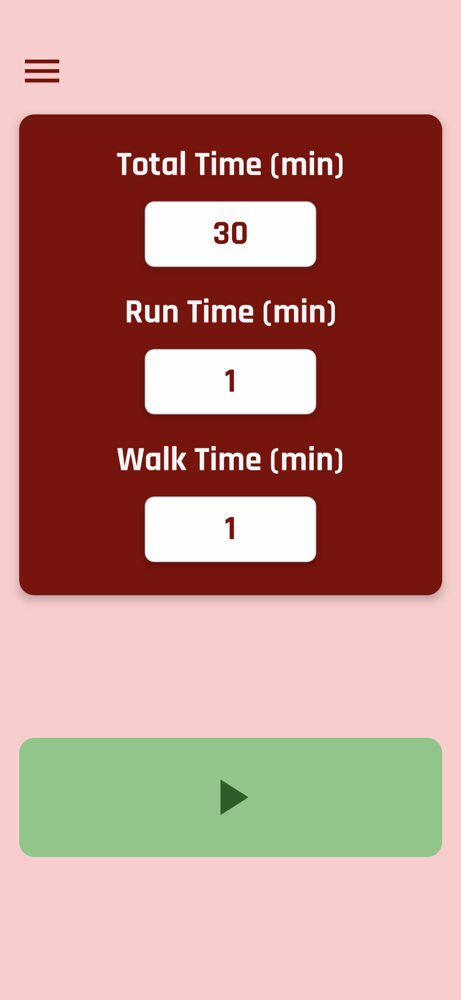
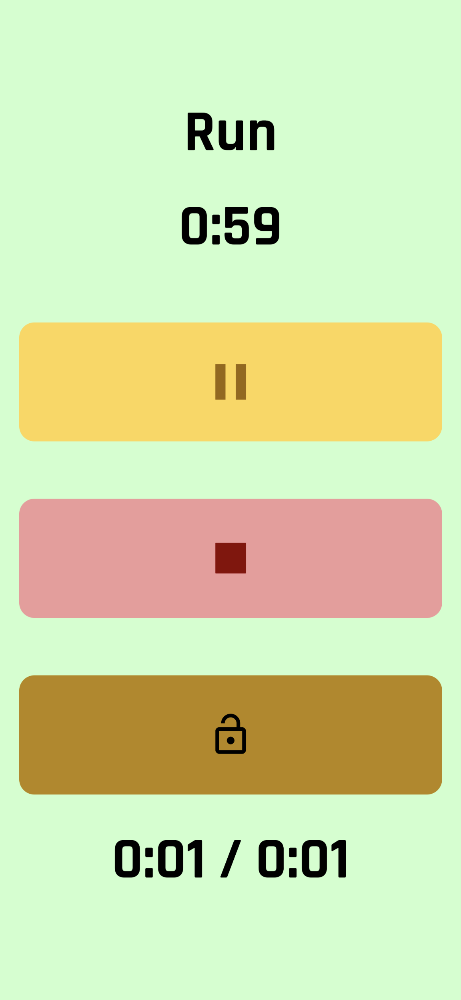
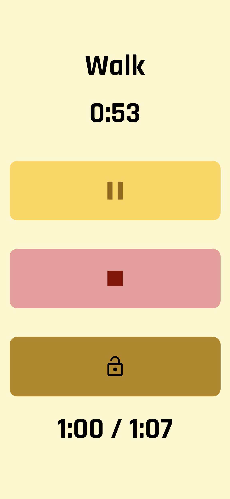
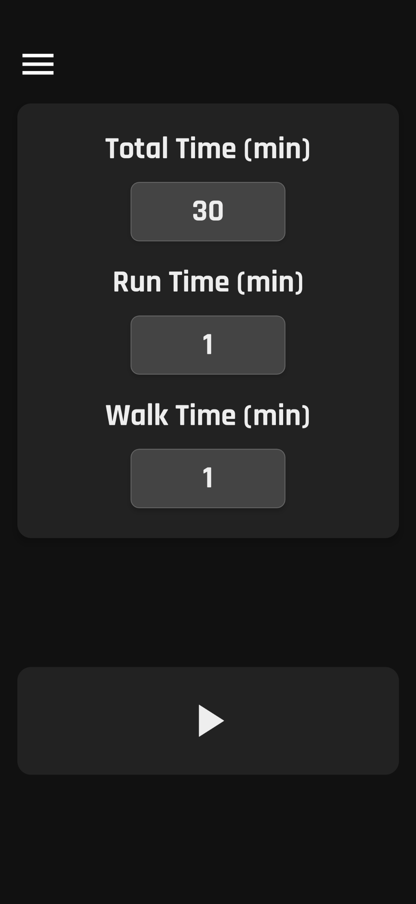
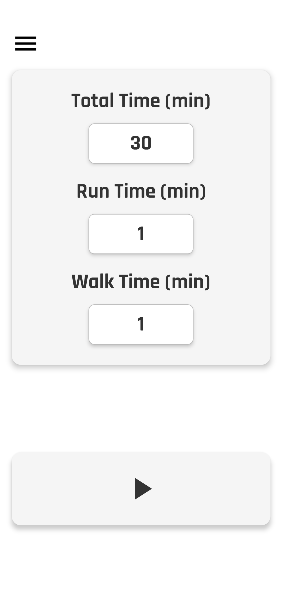

# CardioSplit

**CardioSplit** is a fully customizable run/walk interval timer built with React Native (ejected for Android). It provides real-time visual, audio, and vibration feedback to support cardio training.

---

## Features

- **Custom Intervals** — Set total workout duration, run length, and walk break times.
- **"Ready / Set / Go" Countdown** — Audio cues and onscreen prompts prepare you to begin.
- **Live Timer** — Displays current interval type, countdown, and total elapsed time.
- **Run Time Tracking** — Separate tracking of total run time during a session.
- **Theme Selection** — Choose between light, dark, and high-visibility themes.
- **Persistent Settings** — Remembers your last-used intervals and theme on restart.
- **Audio & Vibration Feedback** — Beeps and buzz patterns distinguish each phase.
- **Lock System** — Prevents accidental taps mid-run by toggling UI buttons.
- **Responsive UI** — Clean layout with smooth transitions and color-coded phases.

---

## Installation

Clone the repository and install dependencies:

```bash
git clone https://github.com/sedrickmoore/cardiosplit-android.git
cd cardiosplit-android
npm install
```

---

## Android Build

This project is ejected from Expo and uses an Android native build.

To build and install the APK locally:

```bash
npx react-native run-android
```

Make sure you have Android Studio and a virtual or physical device connected.

---

## Configuration Notes

- **Audio Files:** Located in `/assets`; used for countdowns and interval changes.
- **Fonts:** Uses [Rajdhani](https://fonts.google.com/specimen/Rajdhani) for styling.
- **Lock Feature:** Long press to toggle visibility of Pause and Stop buttons.

---

## Roadmap

Planned additions for future versions include:

- Google Fit integration  
- Progress history tracking  
- Notification-based reminders and quick actions  

---

## License

MIT License

---

## Screenshots

### Home Screen


### Run Screen


### Walk Screen


### Dark Theme


### High-Visibility Theme
